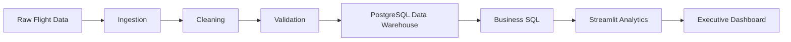
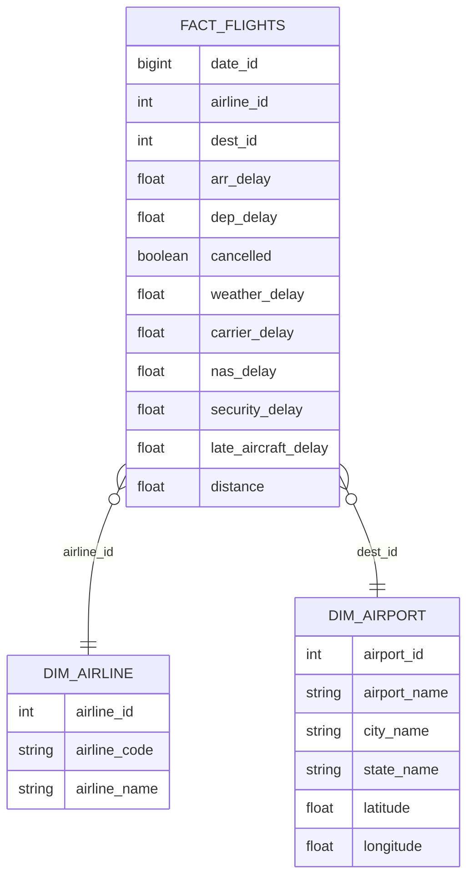

# ✈️ AeroStream


# Enterprise Flight Operations Analytics Platform

**End-to-End Data Engineering \| PostgreSQL Data Warehouse \| Streamlit
Analytics \| Plotly Dashboards**


:::

------------------------------------------------------------------------

## 🚀 Overview

AeroStream is an end-to-end data engineering project that transforms raw
U.S. flight operations data into a modern analytics platform.

The project demonstrates the complete data lifecycle:

-   Data ingestion
-   Cleaning & transformation
-   Data quality validation
-   PostgreSQL star-schema warehouse
-   Business SQL analytics
-   Interactive Streamlit dashboards

**Dataset Scale**

  Metric                    Value
  ------------------ ------------
  Flight Records       2,240,464+
  Fact Tables                   1
  Dimension Tables              2
  Dashboard Pages               4
  Visualizations              15+

------------------------------------------------------------------------

# 🏗️ System Architecture



------------------------------------------------------------------------

# ⭐ Star Schema



------------------------------------------------------------------------

# 📊 Dashboard Modules

## 🏠 Executive Dashboard

-   Flight KPIs
-   Delay Analysis
-   Cancellation Rate
-   Weather Impact
-   USA Airport Operations Map
-   Delay Cause Analysis
-   Monthly Trends

📸 **Screenshot:** `assets/dashboard.png`

------------------------------------------------------------------------

## ✈️ Airline Analytics

-   Airline Rankings
-   Performance KPIs
-   Delay Comparison
-   Performance Leaderboard
-   Airline Analytics Table

📸 **Screenshot:** `assets/airlines.png`

------------------------------------------------------------------------

## 🛫 Airport Analytics

-   Interactive USA Airport Map
-   Airport KPIs
-   Airport Delay Distribution
-   Busiest Airports
-   Airport Leaderboard

📸 **Screenshot:** `assets/airports.png`

------------------------------------------------------------------------

## 🌦 Weather Analytics

-   Weather Impact KPIs
-   Weather vs Arrival Delay
-   Weather Distribution
-   Airlines Most Affected
-   Airports Most Affected

📸 **Screenshot:** `assets/weather.png`

------------------------------------------------------------------------

# 🛠 Tech Stack

  Layer             Technology
  ----------------- --------------
  Language          Python
  Data Processing   Pandas
  Database          PostgreSQL
  SQL               PostgreSQL
  ORM               SQLAlchemy
  Dashboard         Streamlit
  Visualization     Plotly
  Driver            psycopg2
  Version Control   Git & GitHub

------------------------------------------------------------------------

# 📂 Project Structure

``` text
AEROSTREAM/
│
├── analytics/
├── cleaning/
├── ingestion/
├── validation/
├── warehouse/
├── weather/
├── utils/
├── streamlit_app/
│   ├── app.py
│   ├── pages/
│   ├── utils/
│   └── assets/
├── data/
├── main.py
├── requirements.txt
└── README.md
```

------------------------------------------------------------------------

# ▶️ Run Locally

``` bash
git clone https://github.com/BAVAN188/AEROSTREAM.git
cd AEROSTREAM

python -m venv .venv

# macOS / Linux
source .venv/bin/activate

pip install -r requirements.txt

python main.py

streamlit run streamlit_app/app.py
```

------------------------------------------------------------------------

# 📈 Key Engineering Highlights

-   Modular ETL pipeline
-   PostgreSQL warehouse using a star schema
-   Business-focused SQL analytics
-   Multi-page Streamlit application
-   Geospatial airport analytics
-   Weather impact analytics
-   Interactive Plotly visualizations

------------------------------------------------------------------------

# 🚀 Future Enhancements

-   Cloud PostgreSQL (Neon)
-   Streamlit Cloud deployment
-   Docker
-   Apache Airflow
-   CI/CD
-   AWS deployment

------------------------------------------------------------------------

# 👨‍💻 Author

**Bavan Baskar**

GitHub: https://github.com/BAVAN188

If you found this project useful, consider ⭐ starring the repository.
